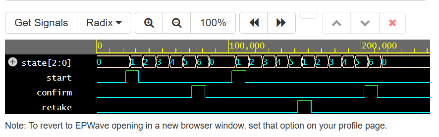
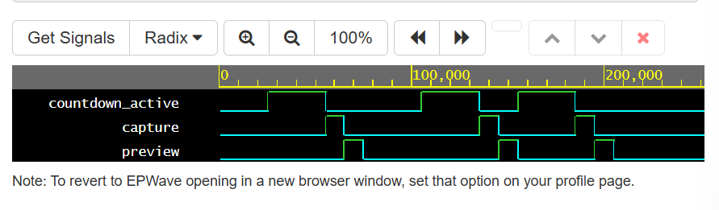
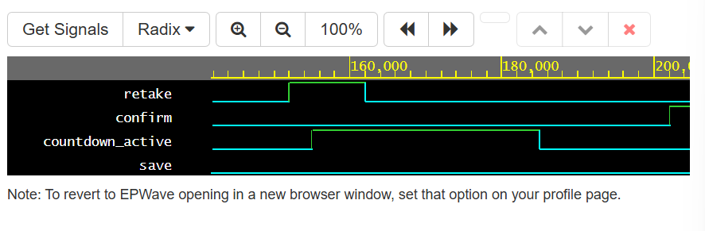

# FSM-Based Photo Booth Controller in Verilog

This project implements a finite state machine (FSM)-based controller for a photo booth / imaging device workflow in Verilog.

## Project Overview

The controller manages a simple imaging sequence:

- Idle
- Countdown
- Capture
- Preview
- Save or retake

This models the control logic of a digital imaging system rather than a software photo booth application.

## Features

- FSM-based digital controller
- Countdown control sequence
- Capture trigger signal
- Preview state
- Save path
- Retake path
- Reset support
- Waveform-based verification

## State Definition

- `IDLE`
- `COUNT3`
- `COUNT2`
- `COUNT1`
- `CAPTURE`
- `PREVIEW`
- `SAVE`

## Inputs

- `clk`
- `rst`
- `start`
- `confirm`
- `retake`

## Outputs

- `countdown_active`
- `capture`
- `preview`
- `save`

## Verification Scenarios

The testbench verifies:
- reset behavior
- normal capture and save flow
- retake flow
- repeated countdown after retake
- final save after retake

## Waveform Results

### State Transition

### Capture Sequence

### Retake and Save

## How to Run

1. Open EDA Playground
2. Select `SystemVerilog/Verilog`
3. Select `Icarus Verilog 12.0`
4. Paste the design into the design window
5. Paste the testbench into the testbench window
6. Enable waveform viewing
7. Run simulation
